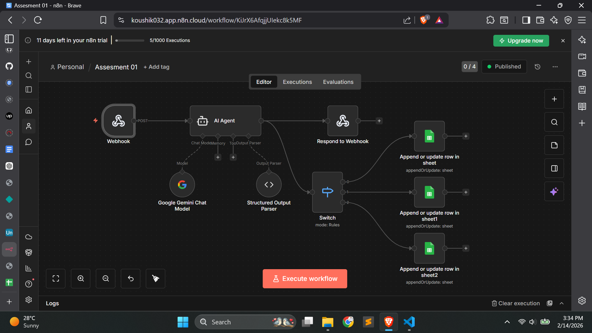
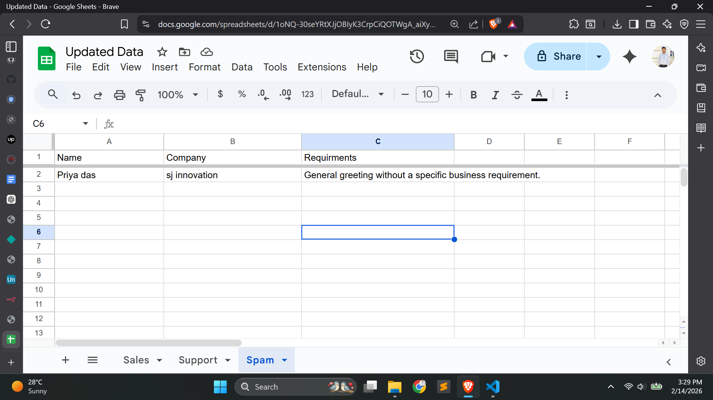

# 🤖 AI Lead Classification & Automation

A web-based system that automatically classifies incoming messages into **Sales, Support, or Spam**, extracts structured data, and returns an automated response.

.png)
.png)



## 🚀 Features
- Classifies messages into Sales, Support, or Spam
- Extracts Name, Company, and Requirement
- Returns auto-response based on intent
- Spam edge-case handling
- Stores results in Google Sheets in different table via n8n workflow
- Real-time response to frontend

## 🛠️ Technologies Used
- HTML5 + Bootstrap
- Vanilla JavaScript
- n8n Workflow Automation
- JSON Structured Output Parsing

## 📥 Installation
1. Clone the repository:
   ```bash
   git clone https://github.com/Koushik032/AI-Agent-Workflow-For-Detection.git